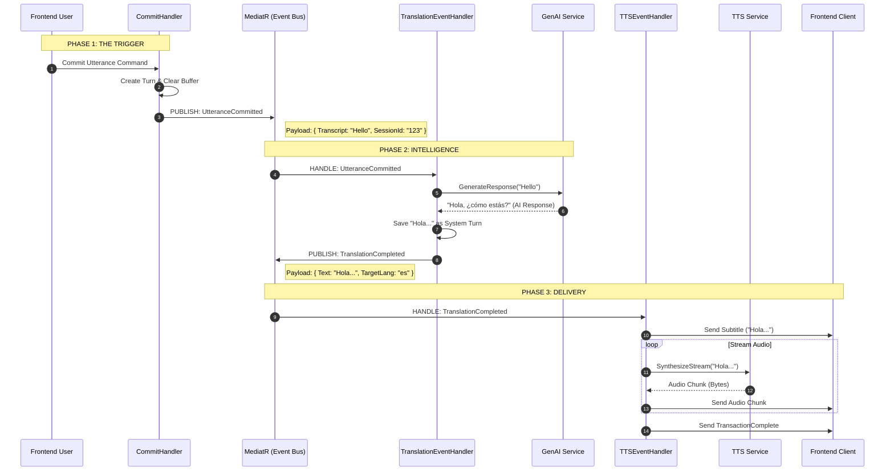

# Event Flow Diagram

This diagram visualizes the "Chain of Responsibility" driven by Domain Events in the new architecture.

## Event Responsibilities

### 1. `UtteranceCommitted`
- **When:** Fired immediately after the user stops speaking and the transcript is finalized.
- **Why:** Signals that there is new input text ready for processing.
- **Who Handles It:** `TranslationEventHandler` (to translate/reply), `FactExtractionHandler` (optional, for memory).

### 2. `TranslationCompleted`
- **When:** Fired after the AI/LLM has successfully generated a response or translation.
- **Why:** Signals that there is output text ready to be spoken.
- **Who Handles It:** `TTSEventHandler` (to generate voice), `NotificationHandler` (to update UI text).
