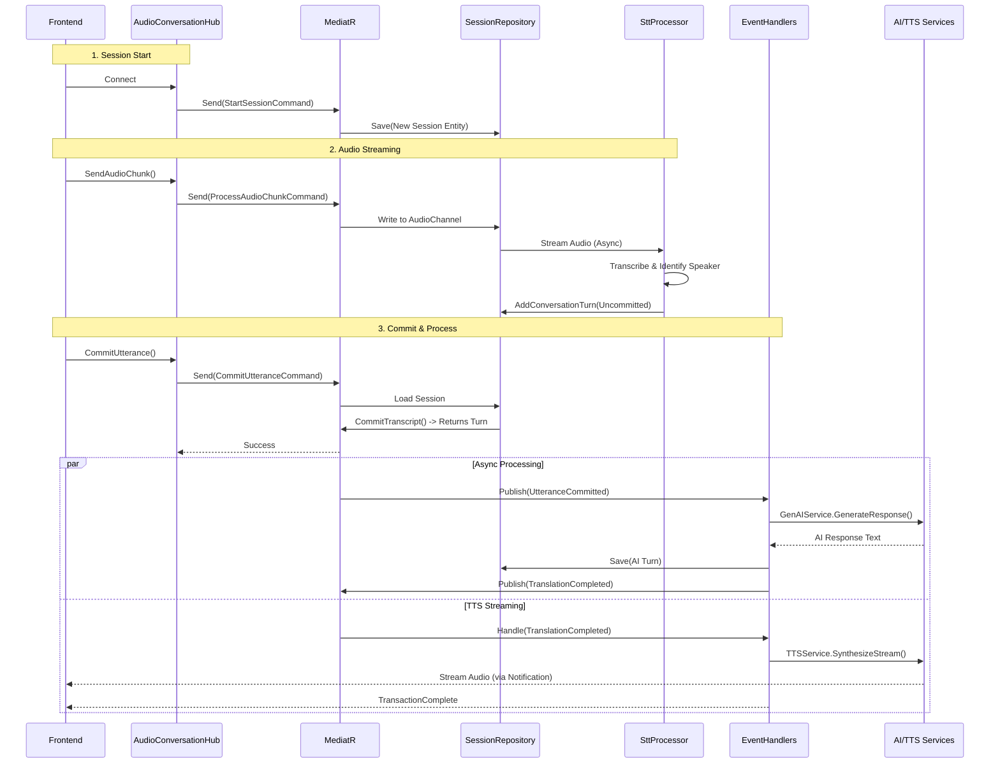

# New Architecture & Cleanup Diagrams

## 1. The New Event-Driven Pipeline
This diagram illustrates the current active flow of the system. Notice that the `RealtimeAudioOrchestrator` is completely absent.



## 2. Component Cleanup Status
This diagram visualizes the codebase status. 
- **<span style="color:red">Red Components</span>** are bypassed and ready for removal.
- **<span style="color:#d4a017">Yellow Components</span>** are transitional (used for initialization or DTOs but logic is moved).
- **<span style="color:green">Green Components</span>** are the new active architecture.

```mermaid
classDiagram
    %% Styles
    classCheck green fill:#e6ffec,stroke:#00b300,stroke-width:2px;
    classWarn yellow fill:#fffbe6,stroke:#d4a017,stroke-width:2px;
    classErr red fill:#ffe6e6,stroke:#ff3333,stroke-width:3px;

    %% --- New Architecture (Green) ---
    class A3ITranslator_Application_Domain_Entities_ConversationSession {
        +CommitTranscript()
        +AddConversationTurn()
    }
    class A3ITranslator_Infrastructure_Persistence_InMemorySessionRepository {
        +GetByConnectionIdAsync()
        +SaveAsync()
    }
    class CommitUtteranceCommandHandler {
        +Handle()
    }
    class TranslationEventHandler {
        +Handle(UtteranceCommitted)
    }
    class SttProcessor {
        +StartProcessing()
        (Refactored to use Repository)
    }

    %% Apply Green Styles
    class A3ITranslator_Application_Domain_Entities_ConversationSession green
    class A3ITranslator_Infrastructure_Persistence_InMemorySessionRepository green
    class CommitUtteranceCommandHandler green
    class TranslationEventHandler green
    class SttProcessor green


    %% --- Legacy / Zombie (Yellow/Red) ---
    
    class RealtimeAudioOrchestrator {
        <<Obsolete>>
        -CommitAndProcessAsync()
        -StreamTTSResponse()
    }
    note for RealtimeAudioOrchestrator "COMPLETELY BYPASSED.\nLogic moved to Handlers.\nSafe to Delete."

    class SessionManager {
        <<Zombie>>
        +CreateSessionAsync()
        +GetSession()
    }
    note for SessionManager "Hub still calls CreateSession,\nbut result is ignored by Pipeline.\nReplace with Command logic fully."
    
    class A3ITranslator_Application_Models_ConversationSession {
        <<Legacy Model>>
    }
    
    class SpeakerRegistry {
        <<Legacy Logic>>
    }

    %% Apply Red/Yellow Styles
    class RealtimeAudioOrchestrator red
    class SessionManager yellow
    class A3ITranslator_Application_Models_ConversationSession yellow
    class SpeakerRegistry red

    %% Relationships
    Repo_Connector --|> A3ITranslator_Infrastructure_Persistence_InMemorySessionRepository : Uses
    CommitUtteranceCommandHandler ..> A3ITranslator_Infrastructure_Persistence_InMemorySessionRepository : Reads/Writes
    SttProcessor ..> A3ITranslator_Infrastructure_Persistence_InMemorySessionRepository : Reads/Writes
    
    SessionManager --> A3ITranslator_Application_Models_ConversationSession : Creates (Unused)
```

## Recommended Cleanup Actions
1. **Delete `RealtimeAudioOrchestrator.cs`**: Ensure `AudioConversationHub` dependency injection is removed first.
2. **Refactor Hub Initialization**: Move the ID generation logic from `SessionManager` to `StartSessionHandler` completely, then remove `SessionManager` call from Hub.
3. **Delete `SessionManager.cs`**: Once Hub is decoupled.
4. **Prune `Models`**: Delete `ConversationSession` (Old), `SpeakerRegistry` (Old) once all compilation errors (mostly DTO mappings) are resolved.
